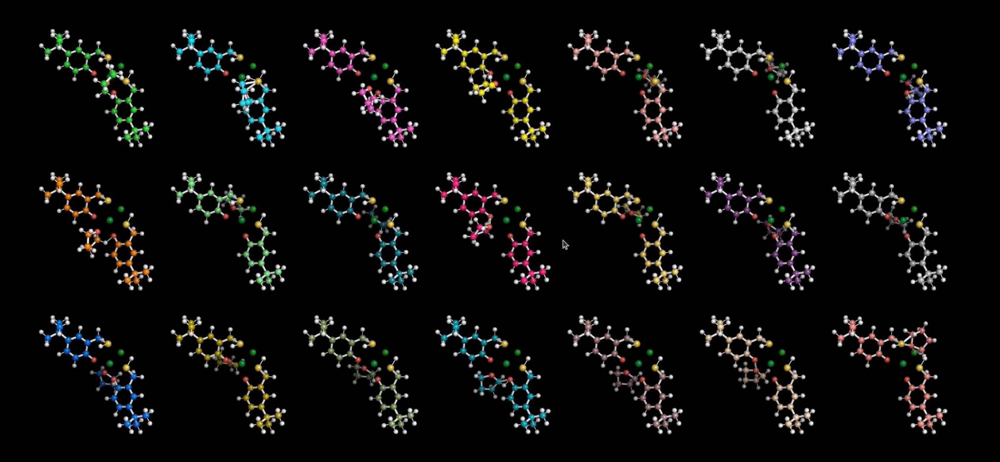

# Coordinate

Coordinate is a suite of tools used to find empty spaces within coordination complexes. It is a very crude approach -- essentially a heuristic based algorithm to find the least sterically hindered spaces within the first coordination sphere.



## Features 

- Find sterically unhindered spaces within a coordination complex
- Create a file to view all potential spaces with dummy atoms (using Avogadro, Molden, etc.)
- Create all acceptable coordination complexes of a desired molecule - ligand pair and write to an .xyz file
  - I would like to thank Robert Shaw for making his xyz to numpy converter freely available at [geomConvert](https://github.com/robashaw/geomConvert)
- Automate TURBOMOLE dft jobs using yaml files (they're like easier to read JSON files)
  - This utility comes mostly from the [turbomoleio](https://github.com/Matgenix/turbomoleio) package maintained by Matgenix SRL
  
## Example of ridft run parameters for a Yb complex
  
```
basis: def2-TZVPP
basis_atom: null
ecp_atom: {yb: ecp-28-mwb}
charge: null
coord_file: coord
desy: false
desy_eps: null
ex_all_states: null
ex_exopt: null
ex_frequency: null
ex_frequency_unit: null
ex_irrep_states: null
ex_method: null
ex_mp2: null
ex_multi: null
functional: tpss
gridsize: m4
ired: false
marij: true
maxcor: null
maxiter: null
method: dft
metric: null
mp2energy: false
usemo: null
ri: true
rijk: false
scfconv: 6
scfiterlimit: 400
sym: c1
sym_eps: null
title: ridft
turbobin: null
unpaired_electrons: null
use_f12: false
use_f12*: null
copymo: null
```

